# MetricMind

## 1. Overview

This project implements an event-driven pipeline that ingests 
synthetic agent metrics, prioritizes them, and escalates critical 
events to a Large Language Model (LLM) for automated 
troubleshooting guidance. It is composed of three decoupled apps 
communicating over Kafka:

- **agent-metrics-publisher** — Publishes fake (synthetic)
  metrics/events to a Kafka topic for testing and repeatable 
  simulations.

- **transformer job** — Consumes incoming events, computes/derives 
  priority, and forwards only highest-priority (critical) events 
  to a dedicated Kafka topic.

- **llm pipe** — Consumes critical events and queries an LLM to 
  suggest troubleshooting decisions and structured fields for 
  downstream consumers.

Two versions of the system are envisioned:

- **Version 1** — Uses synthetic metrics generated by the 
  agent-metrics-publisher app to simulate Kubernetes telemetry. 
  These fake metrics are sent to a Kafka topic for testing and
  repeatable simulations. *(Implemented in current release)*

- **Version 2** — Will collect real metrics directly from Kubernetes 
  cluster resources (pods, nodes, etc.) and send them to a 
  Kafka topic. *(Planned for future implementation)*

In both versions, the flow includes:

- **transformer job** — Consumes incoming metrics, assigns a priority
  level based on predefined rules, and forwards critical
  (highest-priority) events to a dedicated Kafka topic.

- **llm pipe** — Consumes critical events and queries a Large
  Language Model (LLM) to suggest troubleshooting decisions
  and structured guidance.

- **Visualization** — Grafana dashboards display the number of 
  metrics per priority level, enabling quick assessment of 
  the system’s state.

---

## 0. Prerequisites

Before running any component of this project, ensure the following are installed on your system:

- **Docker** — for containerizing and running the apps.  
- **Docker Compose** — for orchestrating multi-container setups and shared networks.  

All apps are designed to run in Docker containers and communicate over a shared Docker network

---

### Architecture Diagram

The following image presents an overview of the project and the 
interaction between the three apps:

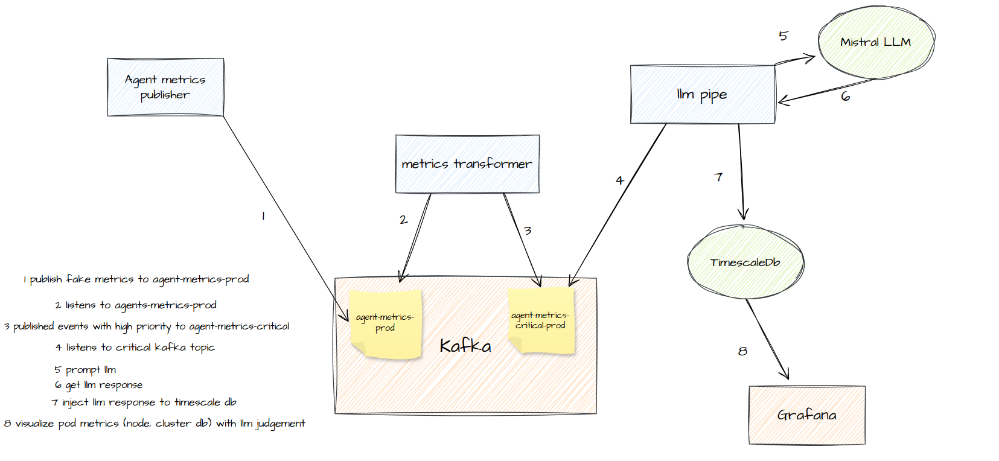

---

In the next sections, each app will be introduced in detail 
(agent-metrics-publisher, transformer job, and llm pipe), with 
dedicated diagrams illustrating their role in the pipeline.


## 2. Agent-Metrics-Publisher

### 2.1 Purpose
The **agent-metrics-publisher** app is responsible for generating 
synthetic metrics that simulate Kubernetes pod activity. The goal 
is to create a continuous stream of realistic test events for the 
pipeline without requiring a live Kubernetes cluster.

### 2.2 Event Schema
Each generated event represents a pod metric in a Kubernetes cluster 
(node, pod, namespace) with CPU and memory usage, along with a 
priority score:
```json
{
  "timestamp": "2025-08-19T10:00:00Z",
  "namespace": "example-namespace",
  "pod": "pod-3",
  "cluster": "controlplane-2",
  "node": "node-1",
  "cpu": 37.5,
  "memory": 8.3,
  "metric_priority": 7
}
```
- timestamp — Event creation time (UTC).

- namespace — Simulated Kubernetes namespace.

- pod — Pod identifier within the namespace.

- cluster — Control plane instance.

- node — Node identifier hosting the pod.

- cpu — CPU usage value (between 5%–90%).

- memory — Memory usage value (between 1–16 GB).

- metric_priority — A derived numeric priority (1–10).

All generated events are published to the Kafka topic: agent-metrics-prod

### 2.3 Metrics & Monitoring

The app tracks its own activity using Prometheus counters:

- generated_events — Number of synthetic metrics generated.

- fake_metrics_published_success — Number of metrics successfully published to Kafka.

- fake_metrics_published_error — Number of metrics that failed to publish to Kafka.

### 2.4 Building and Running

To build and start the app locally:

```bash
cd agent-metrics-job
docker-compose up --build -d
```

### 2.5 Verification

You can verify that the metrics are being published to Kafka using kcat:

```bash
kcat -b localhost:9092 -t agent-metrics-prod -C
```

This will consume and print events from the agent-metrics-prod topic.

The following image presents an overview of the app :

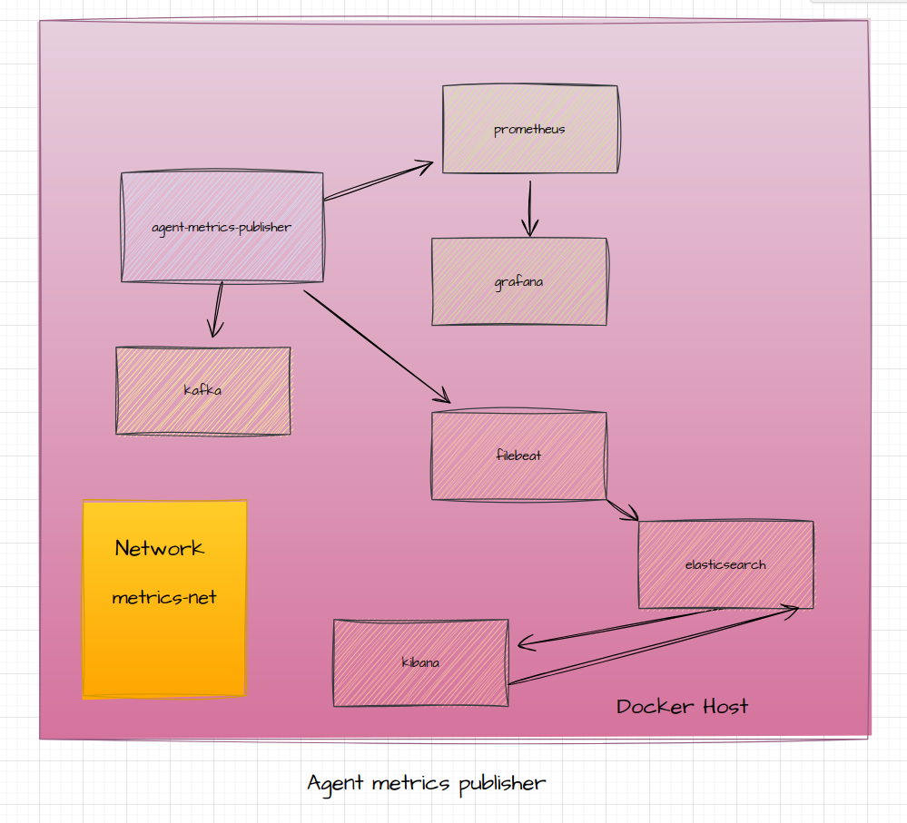


## 3. Metrics-Transformer

### 3.1 Purpose
The **metrics-transformer** app consumes raw synthetic metrics from 
Kafka and filters them by priority. If the **metric_priority** field 
exceeds a configurable `metrics_threshold` value (defined in the 
configuration file), the event is considered critical and forwarded 
to a dedicated Kafka topic.

The following image presents an overview of the app :

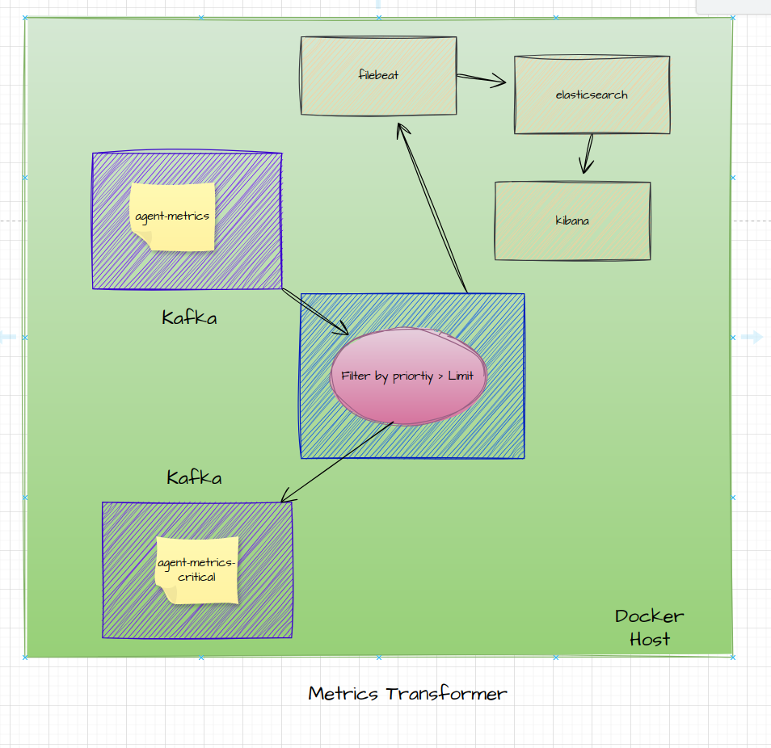


### 3.2 Input and Output Topics
- **Input**:  
  `agent-metrics-prod` — the same topic used by the `agent-metrics-publisher` app.  

- **Output**:  
  `agent-metrics-critical-prod` — contains only events that meet or 
  exceed the configured `metrics_threshold`.  

### 3.3 Configuration
The threshold for filtering is defined in the app’s configuration 
file:

```yaml
metrics_threshold: 3
```

Any event with metric_priority >= metrics_threshold will be sent
to the critical topic.

### 3.4 Building and Running

To build and start the app locally:

```bash
cd metrics-transformer
docker-compose up --build -d
```

The app runs in the same Docker network as the agent-metrics-publisher,
so it uses the same Kafka broker instance. This ensures seamless
consumption and production of events across the pipeline.

### 3.5 Verification

You can verify that the critical metrics are being published to Kafka:

```bash
kcat -b localhost:9092 -t agent-metrics-critical-prod -C
```

This will consume and print events from the agent-metrics-critical-prod topic.

## 4. llm pipe

### 4.1 Purpose
The **llm-pipe** app consumes critical metrics from Kafka, batches 
them according to a configurable threshold, and submits the batch to 
a Large Language Model (LLM) for automated analysis. The app then 
parses the structured LLM response and persists the results into a 
TimescaleDB database for visualization in Grafana.

The following image presents an overview of the app :

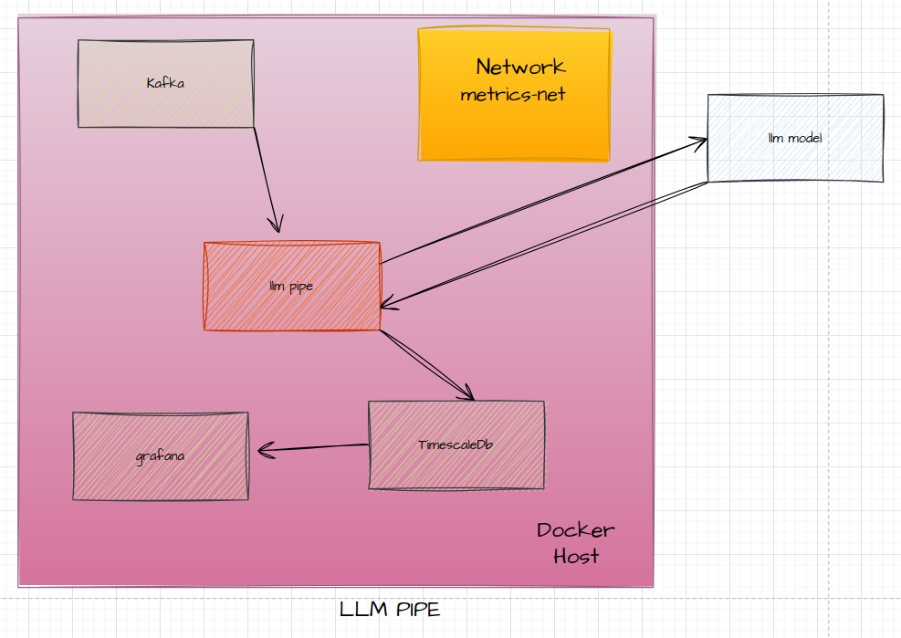

### 4.2 Input and Output
- **Input Topic**:  
  `agent-metrics-critical-prod` — contains events filtered by the 
  metrics-transformer.  

- **Output Storage**:  
  TimescaleDB table `pod_alerts` — stores structured alerts enriched 
  with LLM insights.  

### 4.3 Configuration
The app is configured through a settings file that controls both LLM 
parameters and Kafka consumer options.

```yaml
# LLM settings
Model_Version: "mistral-tiny"
APP_OPERATION: "Analyze these metrics for"
PROMPT_FOCUS: |
  Provide insights focusing on:
    1. issue_description
    2. how to solve the issue
LLM_NUMBER_RETRIES: 2

# Kafka
NUMBER_OF_RETRIES: 3
KAFKA_BOOTSTRAP_SERVERS: "kafka:29092"
GROUP_ID: "llm_consumer"
ENABLE_AUTO_COMMIT: "false"
AUTO_OFFSET_RESET: "latest"
AGENT_METRICS_CRITICAL_PROD: "agent-metrics-critical-prod"
EVENTS_THRESHOLD: 2
```

- **EVENTS_THRESHOLD** — Defines the number of critical events to
accumulate before submitting them to the LLM.

### 4.4 Configuration

- The app uses LangChain to handle the interaction with the LLM
(Mistral).

- The model is prompted with contextual instructions (APP_OPERATION
and PROMPT_FOCUS).

- The LLM’s response is parsed into a structured Pydantic model for
consistency and reliability.

### 4.5 Database Model

The LLM insights are saved into TimescaleDB using the following
schema:

```python
class AlertModel(Base):
    __tablename__ = "pod_alerts"

    id = Column(INTEGER, primary_key=True, autoincrement=True)
    cluster = Column(String)
    timestamp = Column(TIMESTAMP(timezone=True), nullable=False)
    node_identifier = Column(String)
    pod_identifier = Column(String)
    cpu_usage = Column(String)
    memory_usage = Column(String)
    investigation_decision = Column(String)
    alert_level = Column(String)
    troubleshooting_steps = Column(String)

```

### 4.6 Visualization

Grafana connects to TimescaleDB and provides dashboards to visualize:

- The number of critical metrics flagged by the LLM.

- Distribution of alert levels (high/medium/low).


### 4.7 Building and Running

To build and run the llm-pipe locally:

```bash
cd llm-pipe
docker-compose up --build -d
```

The app runs in the same Docker network as the previous components,
allowing it to consume from the agent-metrics-critical-prod topic
and write directly to TimescaleDB.


## 5. App in Action

As mentioned before, **Docker** and **Docker Compose** must be installed 
on your system to build and run the three apps in this project.  
*(A dedicated deployment guide will be added once the apps are prepared 
for Kubernetes, including full configuration details.)*

---

### 5.1 Running the First App (agent-metrics-publisher)

To build and start the **agent-metrics-publisher**:

```bash
cd agent-metrics-job
docker-compose up --build -d
```

Once the app is built, you should see the containers running as shown below:
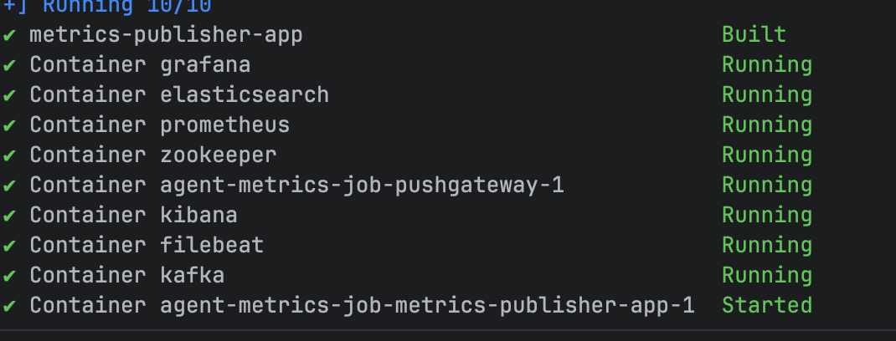

### 5.2 Verifying Events in Kafka

The app continuously generates fake Kubernetes-like metrics and publishes
them to Kafka. You can view these events in the Kafka topic
(agent-metrics-prod) as shown in the following image:
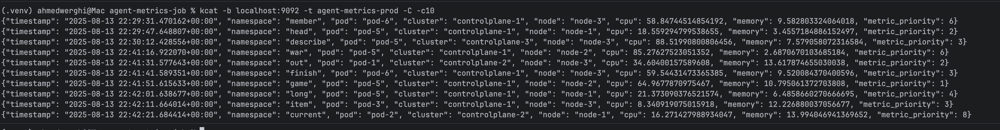

### 5.3 Exposing Metrics with Prometheus

The app exposes internal metrics for monitoring at:
```bash
http://localhost:9091/metrics
```

Prometheus scrapes these metrics, which can be inspected at runtime:
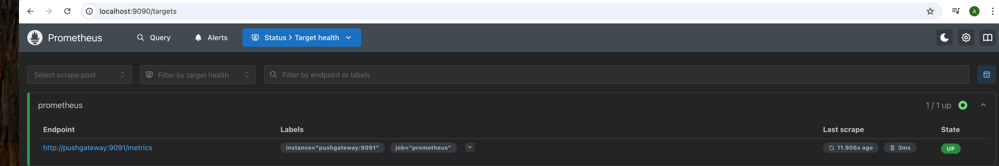

### 5.4 Visualizing with Grafana

Metrics can be visualized using Grafana at:

```bash
http://localhost:3000
```

- Login: admin
- Password: admin (default test configuration)

Steps to create a dashboard:

1- Add Prometheus as a data source.

2- Create a new dashboard.

3- Add visualizations selecting Prometheus as the data source.

4- Query and display metrics generated by the pipeline.

### 5.5 Logs with Kibana

Logs can be explored using Kibana at:

```bash
http://localhost:5601/app/discover#/
```
Steps:

1- Create a new data view.

2- Provide a name and select the filebeat index.

Example screenshots:

- Creating the data view:
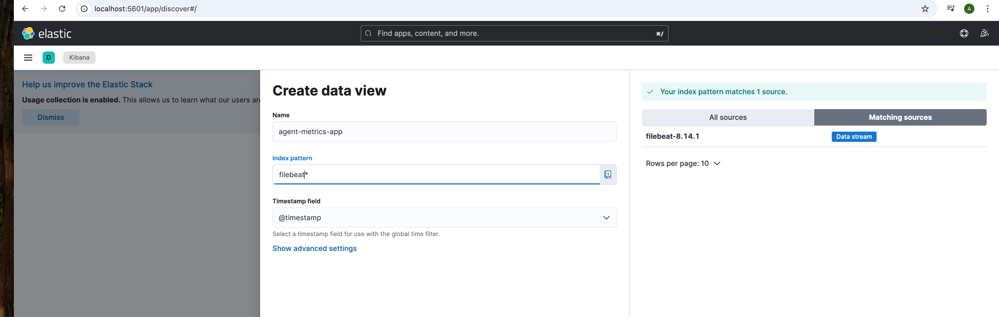

- Viewing logs:
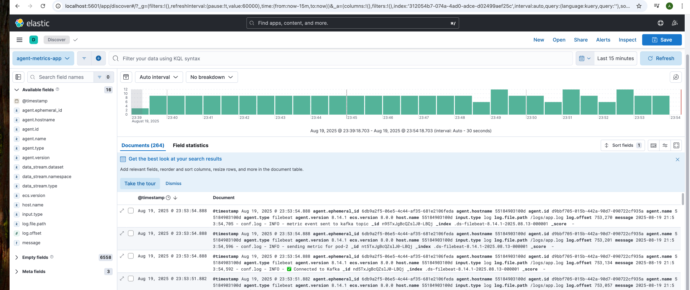

## Metrics transformer 

Metrics transformer job is built the same way as agent-metrics-publisher job,
when the job starts, we can see the filtering to metric with priority exceeding
a certain configured priority
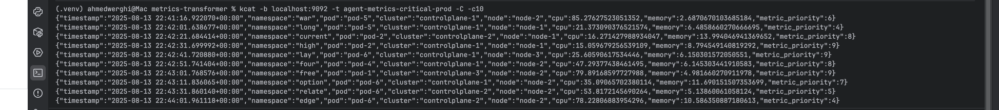

## llm pipe

In order for the **llm-pipe** to function, an LLM model must be 
properly configured. The app relies on LangChain to handle the 
interaction and prompting.  

For testing purposes in this project, the model used is **Mistral** 
(`mistral-tiny`). This can be replaced with another supported LLM 
depending on the deployment environment and available resources.

### 5.6 LLM Pipe Results in Grafana

After building and running the **llm-pipe**, the results of the LLM 
analysis (structured alerts stored in TimescaleDB) can be visualized 
directly in Grafana.

---

#### 5.6.1 Configuring Grafana Data Source

1. Go to Grafana:  http://localhost:3000/

2. Add a new **PostgreSQL** data source with the following settings:  
- **Host**: `timescaledb:5432`  
- **Database**: `alerts_db`  
- **User**: `timescaledb`  
- **Password**: `timescaledb`  
3. Enable the **TimescaleDB** extension flag.  
4. Allow **Unsecured Connection** if using the default local setup.  

---

#### 5.6.2 Building Dashboards

Once the data source is configured, create a new dashboard:  

- Add a visualization and select the `grafana-postgresql-datasource`.  
- Choose **Table View** and run the following query:  

```sql
SELECT DISTINCT alert_level, pod_identifier, node_identifier, cluster, COUNT(alert_level) 
FROM pod_alerts 
GROUP BY alert_level, pod_identifier, node_identifier, cluster
LIMIT 50;
```

This will display aggregated LLM insights as a table:
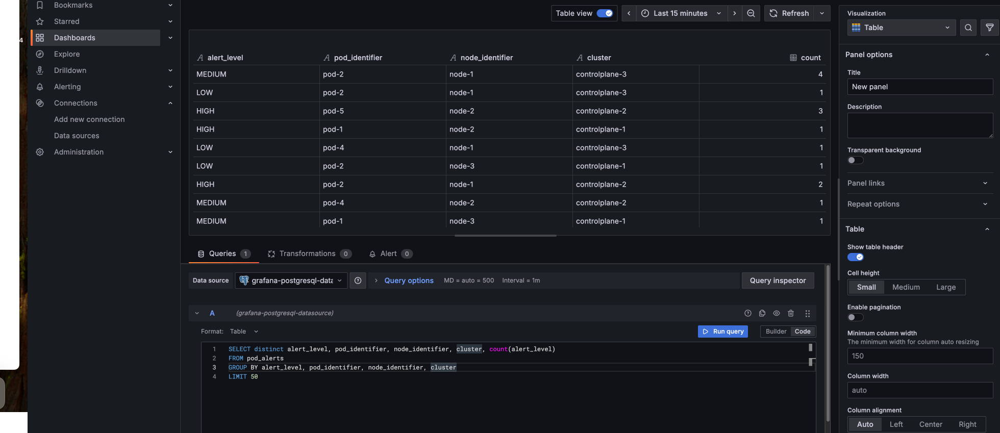

#### 5.6.3 Alternative Views

You can also configure a Bar Chart visualization to represent,
for example, the number of alerts per node based on the LLM’s judgment: 

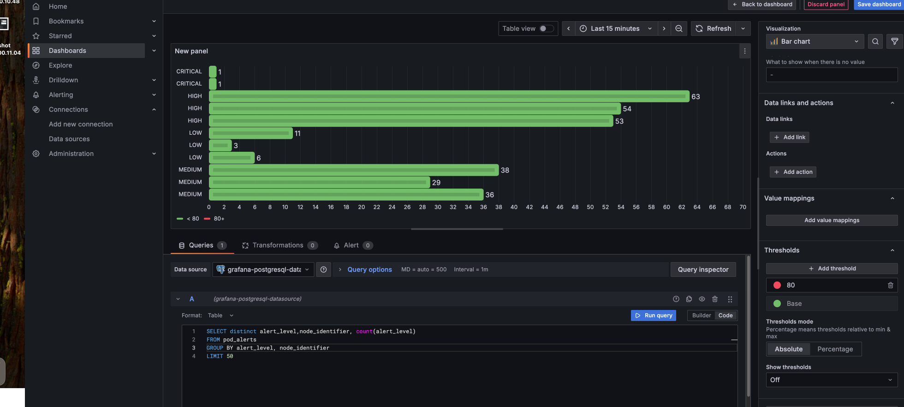


## 6. Project Key Challenges

Several challenges were encountered while designing and implementing this project:

- **Workflow Resilience**  
  Ensuring that the event-driven pipeline could recover gracefully from failures was a primary concern. Kafka played a critical role here, as its asynchronous and fault-tolerant nature provided the backbone for reliable message delivery.

- **Containerized Integration**  
  Orchestrating multiple jobs (publisher, transformer, LLM pipe, databases, monitoring tools) within a shared Docker network required careful configuration. Maintaining seamless connectivity between services was essential to keep the pipeline stable and reproducible.

- **LLM Prompting & TimescaleDB**  
  This project marked the first experience of integrating **LangChain** for structured LLM prompting together with **TimescaleDB** for time-series storage. Aligning the LLM’s structured outputs with the database schema required experimentation and iteration.

Overall, the combination of Kafka’s reliability, Docker’s orchestration, and the new experience of LLM integration with TimescaleDB were the key challenges and learning milestones of this project.
